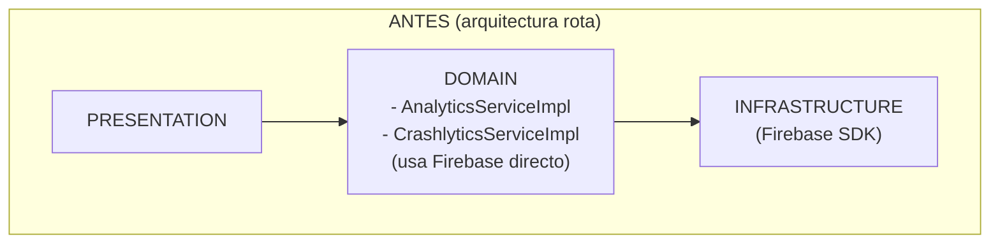
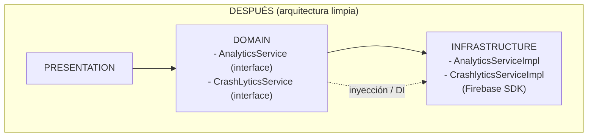

# Firebase y Clean Architecture

Este documento resume la situación previa, por qué rompía Clean Architecture y
la propuesta aplicada/para aplicar, con el objetivo de sustentar el cambio.

## Contexto

El proyecto sigue una estructura tipo Clean Architecture por capas:

- **Presentation**: UI y estado (widgets, cubits, etc.).
- **Domain**: casos de uso, entidades e interfaces (contratos).
- **Infrastructure/Data**: implementación concreta de SDKs, APIs y persistencia.

Firebase es un SDK de infraestructura (Analytics, Crashlytics, Messaging),
por lo tanto **no debe ser consumido directamente por la capa Domain**.

## ¿Qué se estaba rompiendo?

### 1) Dependencias directas de Firebase en la capa Domain

Se encontraron clases en `domain/services` que importaban e instanciaban SDKs
de Firebase. Ejemplo:

- `lib/core/utils/logger/domain/services/analytics_service.dart`
- `lib/core/utils/logger/domain/services/crashlytics_service.dart`


class AnalyticsServiceImpl extends AnalyticsService {
  final FirebaseAnalytics _analytics = FirebaseAnalytics.instance;
}

// Esto está en Domain, cuando debería estar en Infraestructura.

Esto rompe el principio de inversión de dependencias (DIP): la capa Domain no
debe depender de frameworks.

### 2) Inicialización de Firebase distribuida

La inicialización ocurría en `bootstrap` y también en el handler de background
de FCM con llamadas directas a `Firebase.initializeApp()`. Esto duplicaba la
responsabilidad y dejaba la inicialización fuera de una abstracción común.

## Impacto de la ruptura

- Acoplamiento fuerte a Firebase en capa Domain.
- Difícil de testear la lógica de dominio sin el SDK.
- Mayor complejidad para sustituir Firebase por otro proveedor.
- Riesgo de inicializaciones duplicadas o inconsistentes.

## Propuesta de solución (Clean Architecture)

### 1) Mantener **interfaces** en Domain

Las interfaces deben vivir en Domain y no tener dependencias de Firebase:

```dart
abstract class AnalyticsService {
  Future<void> registerLogin(String userName);
  Future<void> registerScreenView(String screenName);
  Future<void> registerUserId(String userId);
  Future<void> registerEvent({ ... });
  Future<bool> sendEvents();
}
```

### 2) Implementaciones en Infrastructure

Las implementaciones concretas del SDK se mueven a infraestructura:

- `lib/core/utils/logger/infrastructure/services/analytics_service_impl.dart`
- `lib/core/utils/logger/infrastructure/services/crashlytics_service_impl.dart`

Estas clases sí dependen de `firebase_analytics` y `firebase_crashlytics`.

### 3) Inicialización unificada de Firebase

Se crea un inicializador único y reutilizable:

- `lib/core/utils/initialization/domain/firebase_app_initializer.dart` (contrato)
- `lib/core/utils/initialization/infrastructure/firebase_app_initializer_impl.dart` (impl)

Así, la inicialización queda centralizada y se usa en:

- `bootstrap` (foreground)
- handler de background de FCM

## Estado después del cambio

- Domain ya no depende de Firebase.
- Firebase vive exclusivamente en Infrastructure.
- La inicialización es única y consistente.
- Se mantiene el flujo de DI (Service Locator).

## Beneficios

- Cumplimiento del principio DIP.
- Mejor testabilidad (se pueden mockear interfaces).
- Menor acoplamiento a proveedores externos.
- Más fácil de mantener y evolucionar.


# Ayuda visual

### ANTES (arquitectura rota)
┌───────────────────────────────┐
│          PRESENTATION         │
└───────────────▲───────────────┘
                │
┌───────────────┴───────────────┐
│            DOMAIN             │
│  - AnalyticsServiceImpl       │
│  - CrashlyticsServiceImpl     │
│  (usa Firebase directamente)  │
└───────────────▲───────────────┘
                │
┌───────────────┴───────────────┐
│        INFRASTRUCTURE         │
│  (Firebase SDK)               │
└───────────────────────────────┘

Problema: Domain depende de Firebase (SDK externo)


### DESPUÉS (arquitectura limpia)
┌───────────────────────────────┐
│          PRESENTATION         │
└───────────────▲───────────────┘
                │
┌───────────────┴──────────────────┐
│            DOMAIN                │
│ - AnalyticsService (interface)   │
│ - CrashLyticsService (interface) │
└───────────────▲──────────────────┘
                │ (inyección / DI)
┌───────────────┴───────────────┐
│        INFRASTRUCTURE         │
│  - AnalyticsServiceImpl       │
│  - CrashlyticsServiceImpl     │
│  (Firebase SDK)               │
└───────────────────────────────┘

Resultado: Domain no conoce Firebase, solo contratos.


