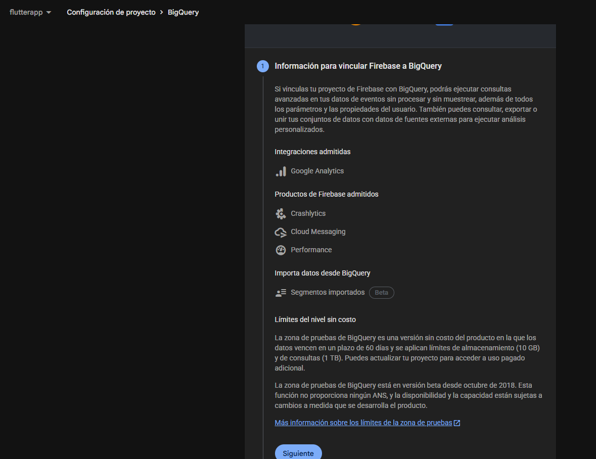

Pasos:

https://www.youtube.com/watch?v=tUZz4IUSngQ

## Fase 1: El Peaje de Entrada (Plan Blaze)
Firebase requiere que tu proyecto esté en el **Plan Blaze (Pay-as-you-go)** para habilitar la exportación a BigQuery.
* **¿Por qué?:** Aunque BigQuery tiene una capa gratuita, el proceso de mover datos de un servicio a otro consume recursos de Google Cloud.
* **Costo inicial:** Si tu app tiene poco tráfico, es muy probable que pagues **$0 USD** al mes, ya que BigQuery regala el primer Terabyte de consultas y los primeros 10 GB de almacenamiento. Pero la tarjeta de crédito debe estar vinculada.

---

## Fase 2: La Vinculación (Paso a Paso)
No necesitas crear nada manualmente en Google Cloud; Firebase lo hará por ti al seguir estos pasos:

1.  Ve a tu [Consola de Firebase](https://console.firebase.google.com/).
2.  Haz clic en el icono de engranaje (⚙️) > **Configuración del proyecto**.
3.  Ve a la pestaña **Integraciones**.
4.  Busca la tarjeta de **BigQuery** y dale a **Vincular**.
5.  **Configuración de datos:** Aquí verás interruptores. Activa:
    * **Google Analytics:** (Asegúrate de incluir "Exportación de publicidad" si usas anuncios).
    * **Crashlytics:** Fundamental para ver patrones de errores que la consola no te muestra.
6.  **Ubicación de los datos:** Selecciona una región cercana a tus usuarios (ej. `us-east1` o `southamerica-east1` para Latam). **Ojo:** Una vez elegida, no se puede cambiar.

---

## Fase 3: ¿Qué sucede en BigQuery ahora?
Una vez que haces clic en "Vincular", Firebase crea automáticamente un **Proyecto de Google Cloud** (si no existía) y un **Dataset**.

* **¿Dónde lo veo?:** Entra a [console.cloud.google.com](https://console.cloud.google.com/) y busca "BigQuery" en el buscador superior.
* **¿Cuánto tarda?:** * Los datos de **Crashlytics** y **Streaming de Analytics** aparecen en minutos.
    * La tabla principal de **Analytics (Daily)** aparecerá mañana con los datos de hoy.

---

## Fase 4: Estructura de Costos y Restricciones (Actualizado 2026)

### Costos de Almacenamiento
* **Primeros 10 GB:** Gratis.
* **Después:** **$0.02 USD por GB** al mes. Para una app estándar, esto son centavos.

### Costos de Consulta (Querying)
Aquí es donde debes tener cuidado. BigQuery cobra por la cantidad de datos que **lee**.
* **Costo:** **$6.25 USD por cada Terabyte** escaneado.
* **Regla de oro:** Nunca hagas `SELECT * FROM tabla`. Siempre selecciona solo las columnas que necesitas.

### Restricciones Críticas
1.  **Límite de eventos:** Si usas la versión estándar de GA4 (gratuita), tienes un límite de **1 millón de eventos por día** para la exportación diaria. Si te pasas, la exportación se detiene a menos que actives el "Streaming" (que cuesta $0.05 por GB enviado).
2.  **Sandbox:** Si decides no poner tarjeta (usar el Sandbox de BigQuery), tus datos **caducarán a los 60 días** y las tablas se borrarán solas.

---

## Fase 5: El "Muro" de los Datos Anidados
Como eres desarrollador, esto te interesa. Los datos de Firebase no llegan en filas planas de Excel. Llegan como **JSONs anidados** (`RECORDS`).

* **Ejemplo:** Un evento de "compra" tiene una columna llamada `event_params`. Dentro de esa columna hay una lista de llaves y valores.
* **La solución:** Tendrás que aprender a usar la función `UNNEST`. 

> **Tip de 2026:** En la consola de BigQuery ahora tienes **Gemini** integrado. Puedes escribir en lenguaje natural: *"Dame los 10 países con más errores de Crashlytics en la última semana"* y Gemini te escribirá el SQL con los `UNNEST` necesarios automáticamente.

---

## Resumen de Investigación para tu Guía
| Componente | Estado Inicial | Acción | Resultado en BigQuery |
| :--- | :--- | :--- | :--- |
| **Analytics** | Reportando en Firebase | Activar vinculación | Tabla `events_YYYYMMDD` |
| **Crashlytics** | Reportando en Firebase | Activar vinculación | Tabla `issue_data` y `cluster_data` |
| **Costos** | $0 | Plan Blaze (Pay-as-you-go) | Facturación mensual según uso |
| **Privacidad** | Estándar | Revisar cumplimiento GDPR/LGPD | Los datos en BQ son tuyos, no de Google |

---

### ¿Cómo quieres seguir?
Tener los datos en BigQuery es solo el 50% del camino. ¿Te gustaría que:
1.  Te pase una **query SQL de ejemplo** para extraer los datos de tus usuarios de Analytics (manejando el tema de los campos anidados)?
2.  ¿Te muestre cómo conectar estos datos a un dashboard en **Looker Studio** para verlos visualmente?
3.  ¿O quizás configurar un flujo en **n8n** para que cuando ocurra un error crítico en Crashlytics te llegue un aviso a Slack/Telegram con el detalle de BigQuery?