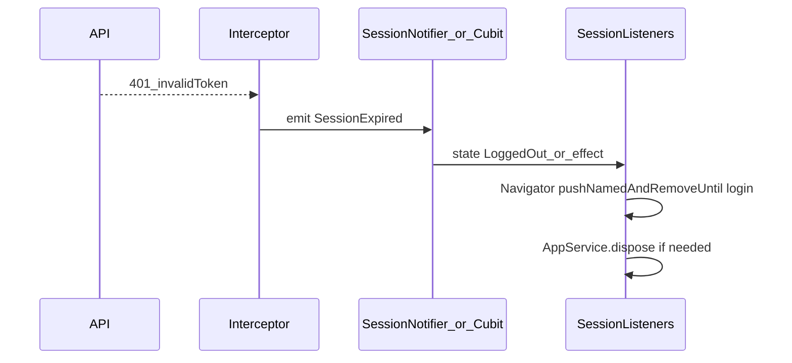

# Análisis y plan de mejora: capas + feature modelo

Documento orientado a un **feature modelo** legible, con widgets alineados al design system, **Cubits centrados en estado**, y separación clara entre presentación, dominio e infraestructura. Está alineado con [presentation-layer.md](presentation-layer.md).

**Convenciones de referencia:** rutas bajo `lib/` respecto a la raíz del paquete `app_mobile`.

---

## 1. Análisis

### 1.1 Qué partes suelen ser las más difíciles de entender (todo el proyecto)

1. **La red de sesión y arranque**  
   El flujo “¿hay usuario?”, “¿token inválido?”, “¿ir a login o home?” está repartido entre:
   - [`lib/core/base/cubit/base_cubit.dart`](../lib/core/base/cubit/base_cubit.dart) (errores, snackbars, `processInvalidToken` que llama a `LoginCubit.logout` con contexto global),
   - [`lib/features/login/presentation/cubit/login/login_cubit.dart`](../lib/features/login/presentation/cubit/login/login_cubit.dart) (login, logout con `Navigator`),
   - [`lib/core/utils/initialization/session_listeners.dart`](../lib/core/utils/initialization/session_listeners.dart) (listeners de `LoginCubit` / `MasterUserCubit` y navegación),
   - [`lib/app/app.dart`](../lib/app/app.dart) (`InitialWidget`, `SharedPreferences`, `StreamBuilder` de errores globales, inicialización en `build`),
   - [`lib/core/utils/initialization/app_service.dart`](../lib/core/utils/initialization/app_service.dart) (`loadSession` / `dispose` con `BuildContext`).

   Para un desarrollador nuevo, **no hay un solo diagrama mental**: hay que seguir globals (`NavigationService.navigatorKey`), streams estáticos (`BaseCubit.streamError`) y listeners anidados.

2. **Features grandes con muchos sub-cubits y listeners**  
   Áreas como alarmas compuestas, mapa (adaptadores GMS/HMS), pagos o home con `MultiBlocListener` acumulan **muchas reacciones a estado** en un solo árbol. Sin sub-widgets o documentación de flujo, el “qué dispara qué” solo se ve leyendo muchos archivos.

3. **Brecha guideline vs código**  
   [presentation-layer.md](presentation-layer.md) indica que el Cubit no debe usar `Navigator` ni `BuildContext`; en el repo aparecen en `LoginCubit`, `BaseCubit`, mapas, onboarding, etc. Eso genera **duda sobre la fuente de verdad**: ¿la regla es el documento o el patrón más usado en legacy?

### 1.2 Por qué surge esa complejidad

| Causa | Efecto |
|--------|--------|
| **Estado y UI mezclados en la base** | `BaseCubit` conoce `SnackBarControl`, `NavigationService` y `LoginCubit`; cualquier cubit hijo hereda ese acoplamiento. |
| **Globals y `static`** | Usuario actual y errores globales viven fuera del árbol de providers; es difícil testear y razonar sobre el orden de eventos. |
| **Side effects en `build`** | Llamar `_initialize()` u otras rutinas desde `build` en [`app.dart`](../lib/app/app.dart) hace que el flujo de arranque sea **no lineal** (cada reconstrucción puede re-disparar lógica). |
| **Servicios que exigen `BuildContext`** | `AppService` necesita contexto para `BlocProvider.of<LoginCubit>` en post-frame; el dominio queda acoplado al árbol de Flutter. |

---

## 2. Mejoras propuestas

Los fragmentos siguientes son **orientativos** (nombres de clases/estados pueden adaptarse al repo); sirven para visualizar el desplazamiento de responsabilidades.

### 2.1 Dos mejoras concretas para **Widgets**

1. **Extraer “listener-heavy” a coordinadores**  
   Donde una página envuelve `MultiBlocListener` con mucha lógica (p. ej. [`home_page.dart`](../lib/features/home/presentation/pages/home_page.dart)), crear widgets como `HomeFlowListeners` o `PolicyReviewListeners` que solo reciban `child` y concentren `listenWhen` / `listener`. La página queda: **Scaffold + composición + design system**.

   **Idea del ajuste — antes (todo en la página):**

   ```dart
   // home_page.dart — mucha orquestación mezclada con layout
   @override
   Widget build(BuildContext context) {
     return MultiBlocListener(
       listeners: [
         BlocListener<PolicyCubit, PolicyState>(/* … */),
         BlocListener<ReviewCubit, ReviewState>(/* … */),
         // …más listeners
       ],
       child: Scaffold(/* … */),
     );
   }
   ```

   **Después (página delgada + coordinador):**

   ```dart
   // home_page.dart
   @override
   Widget build(BuildContext context) {
     return HomeFlowListeners(
       child: Scaffold(
         body: /* composición con design system */,
       ),
     );
   }

   // home_flow_listeners.dart (nuevo widget, solo efectos de UI)
   class HomeFlowListeners extends StatelessWidget {
     const HomeFlowListeners({super.key, required this.child});
     final Widget child;

     @override
     Widget build(BuildContext context) {
       return MultiBlocListener(
         listeners: [
           BlocListener<PolicyCubit, PolicyState>(/* listenWhen + listener */),
           BlocListener<ReviewCubit, ReviewState>(/* … */),
         ],
         child: child,
       );
     }
   }
   ```

2. **Auditar contra el design system antes de duplicar estilo**  
   Centralizar padding, tipografía y botones en [`lib/core/design_system/`](../lib/core/design_system/) (tokens + átomos/moléculas). Regla práctica: **nuevo widget de feature** → primero buscar equivalente en `design_system`; si no existe, añadir al DS si se repite 2+ veces.

   **Idea del ajuste — antes (valores mágicos en el feature):**

   ```dart
   Padding(
     padding: const EdgeInsets.symmetric(horizontal: 16, vertical: 12),
     child: Text(title, style: const TextStyle(fontSize: 14, fontWeight: FontWeight.w600)),
   )
   ```

   **Después (tokens / componentes del DS):**

   ```dart
   // Suponiendo tokens en design_system (nombres ilustrativos)
   Padding(
     padding: AppSpacing.screenHorizontal,
     child: TextSubtitle(text: title), // o TextStyle del theme
   )
   ```

   Si no existe `TextSubtitle` equivalente, **crear un átomo** en `design_system` y reutilizarlo en los features.

### 2.2 Dos mejoras concretas para **Cubits**

1. **Reducir responsabilidades de `BaseCubit`**  
   Separar progresivamente: (a) manejo de errores como **datos en estado** (`UiMessage`, `errorKey`, `ErrorCodeEnum`) y (b) visualización en **widgets** o un **notifier** inyectado (interfaz `UiMessenger` con implementación Flutter). Objetivo: la clase base no importa `design_system` ni abre snackbars directamente.

   **Idea del ajuste — antes (UI desde la capa de estado):**

   ```dart
   void showError(String message, ...) {
     SnackBarControl.showSnackBarError(message: message, ...);
   }
   ```

   **Después (error como dato + capa UI):**

   ```dart
   // Contrato inyectable (core o presentation)
   abstract class UiMessenger {
     void showError(String message, {Duration? duration});
   }

   // En el Cubit: solo estado
   emit(state.copyWith(uiMessage: UiMessage.error('errors.timeout'.translate())));

   // En la página o en un BlocListener global:
   if (state.uiMessage != null) {
     context.read<FlutterUiMessenger>().showError(state.uiMessage!.text);
     context.read<MyCubit>().clearUiMessage();
   }
   ```

2. **APIs sin `BuildContext`**  
   Sustituir `logout(BuildContext context, …)` por algo del estilo `Future<void> logout({required bool expiredMasterUser})` que solo haga orquestación + emisión de `LoggedOut` / efectos declarativos. La **navegación** la ejecuta un listener en la raíz (`SessionListeners` o sucesor), que ya tiene un `BuildContext` válido y estable.

   **Idea del ajuste — antes:**

   ```dart
   Future<void> logout(BuildContext context, bool expired, {required VehicleCubit v}) async {
     await _logout(context);
     if (context.mounted) {
       Navigator.of(context).pushNamedAndRemoveUntil(PageConstants.login, (_) => false);
     }
   }
   ```

   **Después:**

   ```dart
   // login_cubit.dart
   Future<void> logout({required bool expiredMasterUser}) async {
     await _securityService.logout();
     // limpiar suscripciones, etc.
     emit(LoggedOut(expiredMasterUser: expiredMasterUser));
   }

   // session_listeners.dart (o widget raíz)
   BlocListener<LoginCubit, LoginState>(
     listenWhen: (p, c) => c is LoggedOut,
     listener: (context, state) {
       Navigator.of(context).pushNamedAndRemoveUntil(PageConstants.login, (_) => false);
     },
   );
   ```

### 2.3 Dos mejoras para **Servicios o repositorios**

1. **`AppService` sin acoplar a `BlocProvider`**  
   Extraer a un **puerto** lo que hoy hace `_processAfterMounted`: “usuario listo en BD / sesión cargada”. La implementación Flutter puede seguir existiendo, pero **detrás de una interfaz** inyectada (`SessionLifecycle` / `UserBootstrap`) para que tests y dominio no dependan de `BuildContext`.

   **Idea del ajuste — contrato sin Flutter:**

   ```dart
   abstract class SessionLifecycle {
     Future<void> onSessionReady({String? pageName});
     Future<void> onSessionCleared();
   }
   ```

   **Adaptador Flutter** (único lugar que conoce `BuildContext` / `BlocProvider`):

   ```dart
   class SessionLifecycleFlutterAdapter implements SessionLifecycle {
     SessionLifecycleFlutterAdapter(this._readLoginCubit);
     final LoginCubit Function() _readLoginCubit;

     @override
     Future<void> onSessionReady({String? pageName}) async {
       final login = _readLoginCubit();
       await login.setInitialInformation();
       login.listenUserChangesDb();
     }

     @override
     Future<void> onSessionCleared() async { /* sin context si es posible */ }
   }
   ```

   `AppServiceImpl` recibiría `SessionLifecycle` y **ya no** recibiría `BuildContext` en `loadSession` para esas responsabilidades.

2. **Mantener logout y persistencia en servicios; Cubit delgado**  
   [`SecurityService` / repositorio](../lib/features/login/domain/services/security_service_impl.dart) ya concentra `logout`, sesión, linked account, etc. Refuerzo: **un solo lugar** para limpiar tokens y preferencias; el Cubit solo llama al servicio y **mapea** excepciones a estados (`LoginFailure`, etc.).

   **Idea del ajuste — Cubit como fachada delgada:**

   ```dart
   Future<void> logout() async {
     emit(LoginLoading());
     try {
       await _securityService.logout(); // repo + sesión + linked account aquí dentro
       emit(const LoggedOut());
     } on AppException catch (e) {
       emit(LoginFailure.fromAppException(e));
     }
   }
   ```

   Cualquier regla nueva (“borrar caché X”, “revocar push”) va a **`SecurityService` / repositorio**, no al Cubit.

### 2.4 Dos mejoras en **Core** (helpers, base classes, interceptores)

1. **Token inválido: canal explícito**  
   Sustituir el patrón “`BaseCubit` obtiene `navigatorKey.currentContext` y llama `LoginCubit.logout`” por un **`SessionEventSink`** o stream (`SessionEvent.expired`, `SessionEvent.logoutRequested`) consumido **una vez** en la capa de aplicación (widget raíz). Así los interceptores no conocen `LoginCubit`.

   **Idea del ajuste — interceptor / core:**

   ```dart
   sealed class SessionEvent {}

   class SessionExpired extends SessionEvent {
     SessionExpired(this.errorCode);
     final ErrorCodeEnum errorCode;
   }

   class SessionController extends Cubit<SessionEvent?> {
     SessionController() : super(null);

     void notifyExpired(ErrorCodeEnum code) => emit(SessionExpired(code));
   }
   ```

   **Consumo único en la app shell:**

   ```dart
   BlocListener<SessionController, SessionEvent?>(
     listener: (context, event) {
       if (event is SessionExpired) {
         context.read<LoginCubit>().logout(expiredMasterUser: _deriveFlag(event));
       }
     },
   );
   ```

   El interceptor solo hace `sessionController.notifyExpired(code);` sin importar `flutter_bloc` ni rutas.

2. **Errores globales**  
   Evolucionar `BaseCubit.streamError` + `StreamBuilder` en [`app.dart`](../lib/app/app.dart) hacia un **`AppStateCubit`** o ruta dedicada de error, con estado tipado y recuperación clara (evitar pantalla de error opaca para el equipo).

   **Idea del ajuste — estado tipado en lugar de `Stream<String>`:**

   ```dart
   sealed class AppShellState {}

   class AppShellReady extends AppShellState {}

   class AppShellFatalError extends AppShellState {
     AppShellFatalError(this.message, {this.recoverable = true});
     final String message;
     final bool recoverable;
   }

   // app.dart — en lugar de StreamBuilder<String>
   return BlocBuilder<AppShellCubit, AppShellState>(
     builder: (context, state) {
       if (state is AppShellFatalError) {
         return FatalErrorPage(
           message: state.message,
           onAccept: () => context.read<AppShellCubit>().clearError(),
         );
       }
       return const InitialWidget();
     },
   );
   ```

### 2.5 Priorización (impacto vs esfuerzo)

| Mejora | Impacto | Esfuerzo | Notas |
|--------|---------|----------|--------|
| Quitar navegación del `LoginCubit` / efectos en listener | Alto | Medio | Mejora testabilidad y alinea con guideline. |
| Extraer listeners de páginas grandes | Alto | Bajo–Medio | Cambios localizados, riesgo bajo. |
| Delinear `BaseCubit` (sin UI directa) | Muy alto | Alto | Convive mejor si se hace por fases. |
| `AppService` sin `BuildContext` en contrato | Medio–Alto | Medio | Requiere adaptador Flutter. |
| Reemplazar `streamError` por estado de app | Medio | Medio | Tocar arranque y errores globales. |

---

## 3. Autenticación: inicio y cierre de sesión

### 3.1 Inicio

- **Una sola fuente de verdad** para “sesión activa”: combinar preferencia persistida (`SharedPreferences`) con **`LoginState`** (o un `SessionStatus` explícito) para evitar condiciones donde la UI cree una cosa y el cubit otra.
- **Orden recomendado:** restaurar/leer usuario y tokens en dominio/infra → emitir estado (`LoggedIn` / `LoggedOut` / `AwaitingRestore`) → **listeners** navegan o muestran splash; evitar mezclar eso con side effects repetidos en `build`.
- **`loadSession`** en [`app_service.dart`](../lib/core/utils/initialization/app_service.dart) puede seguir existiendo, pero idealmente disparado desde un punto de ciclo de vida claro (`initState` + una sola corrutina), no desde cada reconstrucción.

### 3.2 Cierre

- **Pipeline único:** `SecurityService.logout` (y limpieza asociada) → el Cubit emite **`LoggedOut`** (y flags como `expiredMasterUser` si aplica) → **un solo listener** hace `pushNamedAndRemoveUntil` y `dispose` de servicios que hoy necesitan contexto.
- **Token inválido e impersonación:** el mismo pipeline que logout manual; diferencias solo en **flags de estado** o eventos secundarios (snackbar de “sesión expirada”), no en otra ruta de navegación paralela.



---

## 4. Reutilización: mixins, extensiones y utils

| Herramienta | Cuándo usarla | Ejemplo |
|-------------|----------------|---------|
| **Mixin** | Comportamiento compartido en **clases** que necesitan `super` múltiple o hooks repetidos en State / widgets concretos. | `mixin PostFrameMixin on State { void afterFirstLayout(VoidCallback fn) { ... } }` |
| **Extensión** | API ergonómica sobre un tipo **sin** estado adicional: formateo, getters derivados, shortcuts de `BuildContext` **sin** guardar lógica de negocio. | `extension UserDisplay on UserEntity { String get initials => ... }` |
| **Utils** | Funciones **puras**, sin `BuildContext`, sin dependencia de widget: validación, parsing, formato estable. | `String? validateEmail(String? s)` en `lib/core/utils/validators.dart` |

**Mini-ejemplos (ilustrativos):**

```dart
// Mixin: reutilizar en varios State
mixin SafeBlocRead on State {
  T? readBloc<T extends Cubit<Object>>() =>
      mounted ? context.read<T>() : null;
}
```

```dart
// Extensión: ergonomía sobre dominio
extension DateUi on DateTime {
  String toShortDate(String locale) => DateFormat.yMd(locale).format(this);
}
```

```dart
// Utils: función pura
String sanitizeDigits(String input) => input.replaceAll(RegExp(r'\D'), '');
```

---

## 5. Refactorización: Cubit y `BuildContext`

### 5.1 Caso típico en este repo

**`LoginCubit.logout`** recibe `BuildContext`, llama a `_logout` y en `finally` usa `Navigator.of(context).pushNamedAndRemoveUntil` ([`login_cubit.dart`](../lib/features/login/presentation/cubit/login/login_cubit.dart) aprox. líneas 78–103).

**`BaseCubit.processInvalidToken`** obtiene contexto con `NavigationService.navigatorKey.currentContext!` y llama al mismo `logout` ([`base_cubit.dart`](../lib/core/base/cubit/base_cubit.dart) aprox. líneas 152–164).

Problemas: el cubit **no es portable a tests** sin Flutter, el orden navigator/context puede fallar si el árbol no está montado, y se viola la separación presentación/dominio descrita en la guía.

### 5.2 Cómo refactorizar sin ensuciar los widgets de feature

- El **widget raíz** que ya envuelve la app (`SessionListeners` o `MaterialApp` ancestor) **sí** debe orquestar navegación: es el lugar correcto para `Navigator` y para llamar `AppService.dispose` con un `BuildContext` bajo control.
- Los widgets de pantallas (login form, home) solo hacen `context.read<LoginCubit>().logoutFlags(...)` **sin** pasar `BuildContext` al cubit.
- Opcional: usar **`BlocListener` solo en la raíz** con `listenWhen` sobre `LoggedOut` + metadata (`SessionClosedReason`).

---

## 6. Ejecución: ejemplo de implementación (antes vs después)

**Mejora elegida:** extraer la **navegación post-logout** (y el dispose que requiere contexto) del `LoginCubit` hacia el **listener de sesión** (alto impacto, esfuerzo medio).

### 6.1 Antes (patrón actual)

Firma y uso mezclados con UI:

```dart
// login_cubit.dart — idea actual
Future<void> logout(
  BuildContext context,
  bool expiredMasterUser, {
  required VehicleCubit vehicleCubit,
}) async {
  try {
    await _logout(context);
  } finally {
    if (context.mounted) {
      Navigator.of(context).pushNamedAndRemoveUntil(
        PageConstants.login,
        (route) => false,
      );
      if (expiredMasterUser) _showMessageTokenExpiredUserMaster();
    }
  }
}
```

Y desde `BaseCubit`:

```dart
// base_cubit.dart — idea actual
BuildContext context = NavigationService.navigatorKey.currentContext!;
if (context.mounted) {
  await context.read<LoginCubit>().logout(
    context,
    userMasterExpired,
    vehicleCubit: context.read<VehicleCubit>(),
  );
}
```

### 6.2 Después (objetivo)

**Cubit:** solo estado y llamadas a dominio/servicios.

```dart
// login_cubit.dart — objetivo
Future<void> logout({required bool expiredMasterUser}) async {
  emit(LoginLoading()); // o un estado intermedio explícito
  try {
    await _performLogoutSideEffects(); // sin BuildContext: servicios puros
    _userpilotService.logout();
    await _analyticsService.sendEvents();
    await _securityService.logout();
    userSubscription?.cancel();
    super.currentUser = null;
    emit(LoggedOut(expiredMasterUser: expiredMasterUser));
  } catch (e, st) {
    emit(LoginFailure(...));
    addError(e, st);
  } finally {
    _versioningService.checkAndPerformVersioning();
    traceabilityService.dispose();
  }
}
```

**Raíz (p. ej. ampliar `SessionListeners`):** reaccionar al estado y mover `VehicleCubit` / `AppService.dispose` aquí.

```dart
BlocListener<LoginCubit, LoginState>(
  listenWhen: (p, c) => c is LoggedOut,
  listener: (context, state) {
    final loggedOut = state as LoggedOut;
    unawaited(locator<AppService>().dispose(context: context));
    if (!context.mounted) return;
    context.read<VehicleCubit>().clearAutoInterrogateList(); // si aplica
    Navigator.of(context).pushNamedAndRemoveUntil(
      PageConstants.login,
      (_) => false,
    );
    if (loggedOut.expiredMasterUser) {
      // mostrar modal vía ModalControl o Navigator, con contexto válido
    }
  },
  child: child,
);
```

**Beneficio:** los tests del `LoginCubit` verifican **emisiones**; los tests de widget/integration verifican **navegación** una vez. Se reduce el uso de `NavigationService.navigatorKey` como atajo desde la capa de estado.

---

## Referencias cruzadas

- [presentation-layer.md](presentation-layer.md) — responsabilidades de Cubits y widgets.
- Archivos citados: [`base_cubit.dart`](../lib/core/base/cubit/base_cubit.dart), [`login_cubit.dart`](../lib/features/login/presentation/cubit/login/login_cubit.dart), [`session_listeners.dart`](../lib/core/utils/initialization/session_listeners.dart), [`app.dart`](../lib/app/app.dart), [`app_service.dart`](../lib/core/utils/initialization/app_service.dart).
